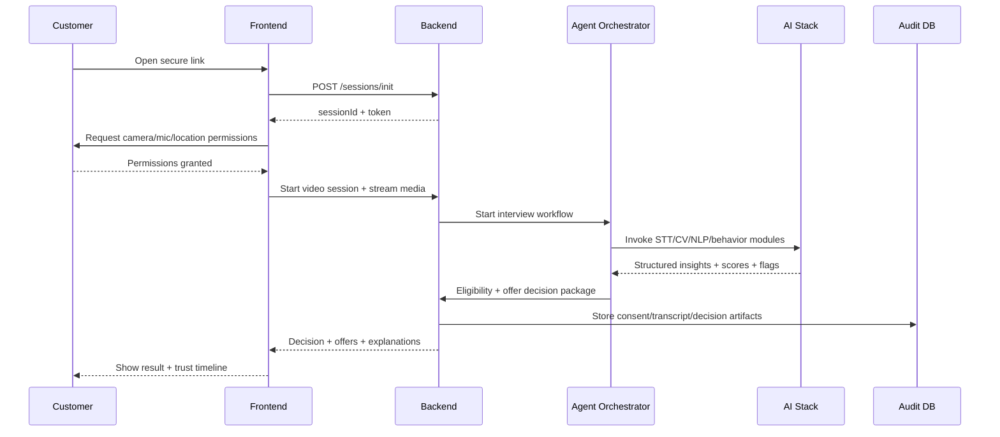
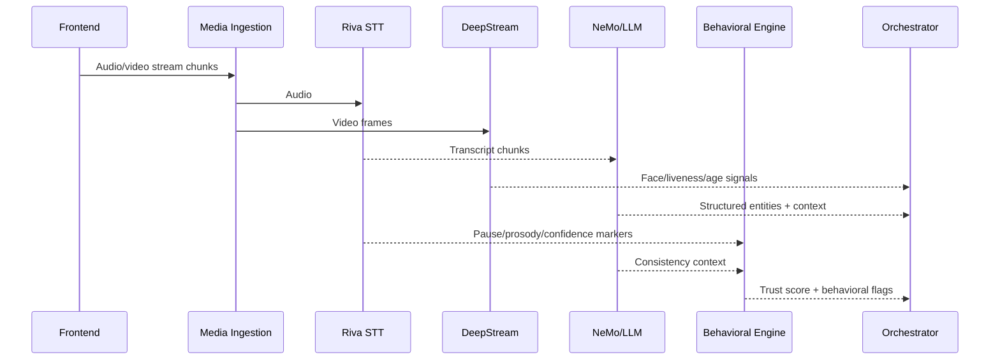
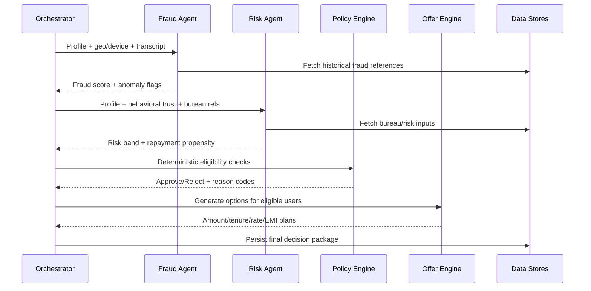
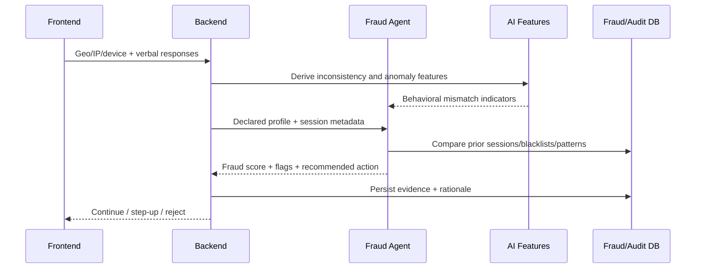

# TrustLens AI — Product Requirements Document (PRD)

## 1. Problem Statement
Traditional digital loan onboarding is form-heavy, easy to manipulate, and weak at real-time trust evaluation. Manual KYC adds delay and cost, while lenders struggle to assess intent, consistency, and repayment reliability during onboarding.

TrustLens AI addresses this gap with a compliance-first, video-based onboarding system that combines adaptive AI interviews, behavioral trust scoring, fraud checks, and instant decisioning.

---

## 2. Goals & Objectives
- Digitize loan onboarding end to end with minimal manual intervention.
- Reduce fraud and misrepresentation risk in real time.
- Improve conversion by replacing long forms with adaptive conversation.
- Capture consent and KYC artifacts in an audit-ready format.
- Generate explainable, personalized loan offers instantly.

---

## 3. Target Users
- **Primary:** NBFC digital lending teams and risk operations.
- **Secondary:** Compliance, KYC, fraud, and audit teams.
- **End-user:** Loan applicants on mobile/web.

---

## 4. Detailed Feature Breakdown

### 4.1 Cognitive Interview Engine
- AI-led adaptive questioning instead of static scripts.
- Follow-up prompts based on confidence gaps and inconsistencies.
- Structured capture of employment, income, intent, and loan purpose.

### 4.2 Behavioral Trust Engine (USP)
- Prosody- and response-based trust features (hesitation, confidence, consistency).
- Trust Score (0–100), truthfulness confidence, and behavioral risk flags.

### 4.3 Compliance & KYC Layer
- Face presence/liveness + age-estimation signal.
- Verbal consent capture with timestamped transcript anchors.
- Geo-location and device/IP checks for fraud/compliance.
- Full audit trail of actions and decisions.

### 4.4 Risk & Decision Engine
- Deterministic policy checks (eligibility, exclusions, limits).
- AI-assisted risk banding and repayment propensity.
- Offer generation (amount, tenure, rate, EMI options).
- Explainable decision rationale and reason codes.

### 4.5 Multi-Agent AI System
- Interview Agent
- Understanding Agent
- Fraud Detection Agent
- Risk Scoring Agent
- Loan Offer Agent

An orchestrator coordinates agent outputs while deterministic policy remains the final gate.

---

## 5. End-to-End User Journey
1. User opens secure onboarding link from campaign channel.
2. Session initializes and permission/consent flow begins.
3. Live AI video interview starts.
4. System captures video, audio, geo, and session metadata in parallel.
5. STT, NLP, behavioral analysis, and fraud checks run in near real time.
6. Risk and policy evaluation compute eligibility.
7. System generates and displays approval/rejection + offer options.
8. Audit repository stores transcript, consent, signals, and decisions.

---

## 6. Functional Requirements
- **FR-01:** Secure tokenized session creation and lifecycle management.
- **FR-02:** Real-time audio/video ingestion and session metadata capture.
- **FR-03:** Streaming STT with transcript persistence.
- **FR-04:** Consent phrase detection and compliant recording.
- **FR-05:** Face/liveness/age signal extraction from video stream.
- **FR-06:** Structured profile extraction from conversational transcript.
- **FR-07:** Behavioral trust scoring and inconsistency detection.
- **FR-08:** Fraud rule execution (geo/device/response mismatch).
- **FR-09:** Risk scoring and deterministic policy evaluation.
- **FR-10:** Personalized offer and EMI generation for eligible users.
- **FR-11:** Explainable output with reason codes and trust timeline.
- **FR-12:** Centralized audit logging and retrieval APIs.

---

## 7. Non-Functional Requirements
- **Latency:** Interim insights under 2 seconds; decision completion target under 120 seconds.
- **Scalability:** Horizontal scaling for concurrent video sessions.
- **Reliability:** 99.9% uptime target for onboarding APIs.
- **Security:** Encryption in transit/at rest, RBAC, PII masking.
- **Compliance:** Immutable audit logs, consent traceability, decision replay.
- **Observability:** End-to-end tracing, model versioning, decision lineage.

---

## 8. Success Metrics
- Onboarding completion rate
- Median decision turnaround time
- Fraud detection precision/recall
- Manual review rate reduction
- Consent capture completeness
- Offer acceptance rate
- Audit retrieval SLA compliance

---

## 9. Risks & Mitigation
- **False positives in trust/fraud:** confidence thresholds + manual review queue.
- **Model drift/bias:** periodic recalibration, monitoring, rollback strategy.
- **Poor media quality:** quality gates, fallback prompts, retry handling.
- **Regulatory challenge:** reason-code transparency + immutable evidence trail.
- **Complex orchestration:** modular services + event-driven pipeline + retries.

---

## 10. Hackathon Differentiation
- Behavioral trust scoring layered on top of traditional underwriting.
- Adaptive interview flow replacing static form experience.
- Real-time AI + policy fusion for instant decisioning.
- Compliance-first architecture with consent and audit replay.
- Trust timeline visualization for explainability and demo impact.

---

## 11. System Architecture (Real Flow)

### 11.1 Step-by-Step System Flow
1. **Session Gateway** validates campaign token and initializes applicant session.
2. **Frontend (React/Next.js)** opens media channel and collects permissions/geo.
3. **Media Ingestion Service** splits audio/video streams.
4. **Audio Pipeline:** Riva STT transcribes streaming speech.
5. **Video Pipeline:** DeepStream extracts face/liveness/age signals.
6. **Understanding Layer:** NeMo/LLM normalizes transcript into structured fields.
7. **Behavioral Layer:** hesitation/confidence/consistency signals become trust score.
8. **Fraud Layer:** geo/device/IP + statement mismatch analysis.
9. **Risk + Policy Engine:** deterministic eligibility and risk constraints.
10. **Offer Engine:** generates amount, tenure, rate, EMI options.
11. **Audit Service:** stores transcript, consent, signals, reasons, offer payload.
12. **Frontend Output:** decision, explanation, and trust timeline.

### 11.2 Data Flow
Capture (video/audio/geo/meta) → Process (STT/CV/NLP/behavior) → Evaluate (fraud/risk/policy) → Decide (approve/reject/conditional) → Store (audit logs) → Display (decision + offers + explanation).

### 11.3 Compliance Flow
- Consent must be captured and logged before final decision.
- KYC signals (face/liveness/age) are linked to session events.
- Geo/device/IP checks are timestamped for traceability.
- Final decision always includes policy rule IDs and reason codes.

---

## 12. Sequence Diagrams (Mermaid)

### 12.1 Full Onboarding Flow

### 12.2 Video + AI Processing

### 12.3 Loan Decision Pipeline

### 12.4 Fraud Detection Flow

---

## 13. API Design

| Endpoint | Purpose | Input | Output |
|---|---|---|---|
| `POST /api/v1/sessions/init` | Initialize onboarding session | campaignToken, channel | sessionId, authToken, expiresAt |
| `POST /api/v1/sessions/{id}/start` | Start controlled video session | permissions, deviceMeta, geo | sessionState, streamConfig |
| `POST /api/v1/stream/audio` | Ingest audio chunk for STT/behavior | sessionId, chunk, ts | ack, transcriptRef |
| `POST /api/v1/stream/video` | Ingest video frame batch for CV | sessionId, frameBatch, ts | ack, visionRef |
| `POST /api/v1/consent/capture` | Log explicit consent event | sessionId, consentText, transcriptRef | consentId, complianceStatus |
| `POST /api/v1/profile/extract` | Build structured applicant profile | sessionId, transcriptRefs | profile, confidence |
| `POST /api/v1/fraud/evaluate` | Run fraud checks | sessionId, profile, geo, ip, device | fraudScore, flags, action |
| `POST /api/v1/risk/evaluate` | Run risk and eligibility modeling | sessionId, profile, bureauRef, trustScore | riskBand, propensity, policyHints |
| `POST /api/v1/decision/generate` | Final deterministic decision | sessionId, fraudResult, riskResult, policyVersion | status, reasonCodes, explanation |
| `POST /api/v1/offers/generate` | Generate offer options | sessionId, decisionStatus, riskBand | offers (amount, tenure, rate, emi) |
| `GET /api/v1/sessions/{id}/timeline` | Return trust/compliance timeline | sessionId | ordered timeline events |
| `POST /api/v1/audit/store` | Persist final audit package | sessionId, transcript, signals, decision | auditRecordId |
| `GET /api/v1/decision/{id}` | Fetch final decision output | decisionId | status, explanation, offers |

---

## 14. AI Components (Real vs Mocked for Hackathon)

| Component | Role | Working Method | Hackathon State |
|---|---|---|---|
| Cognitive Interview Agent | Adaptive questioning | Prompt templates + context-aware follow-ups | Real/Partial |
| NVIDIA Riva STT | Real-time transcription | Streaming ASR with timestamps | Real/Partial |
| NVIDIA DeepStream Vision | Face/liveness/age signals | Frame-level inference | Mock/Partial |
| Understanding Agent | Structured extraction | LLM + rule normalization | Real |
| Behavioral Trust Engine | Trust/confidence scoring | Prosody + pause + contradiction heuristics | Mock/Partial |
| Fraud Detection Agent | Fraud risk evaluation | Metadata mismatch + semantic inconsistency | Real/Partial |
| Risk Scoring Agent | Repayment risk banding | Bureau proxy + risk model + policy buckets | Mock/Partial |
| Loan Offer Agent | Offer plan creation | Rule-based optimization on eligibility/risk | Real |
| Explainability Layer | Reason codes & timeline | Maps outputs to human-readable rationale | Real |

