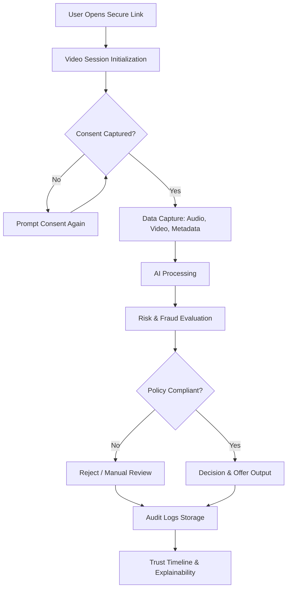
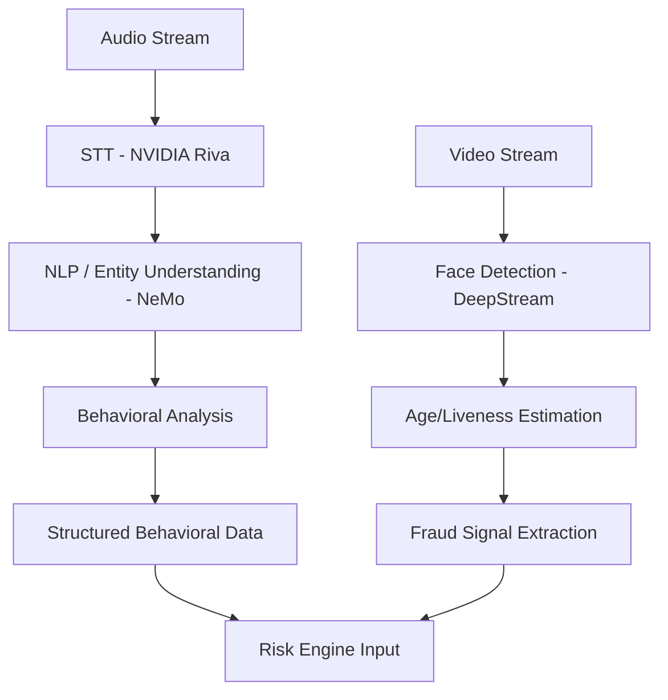
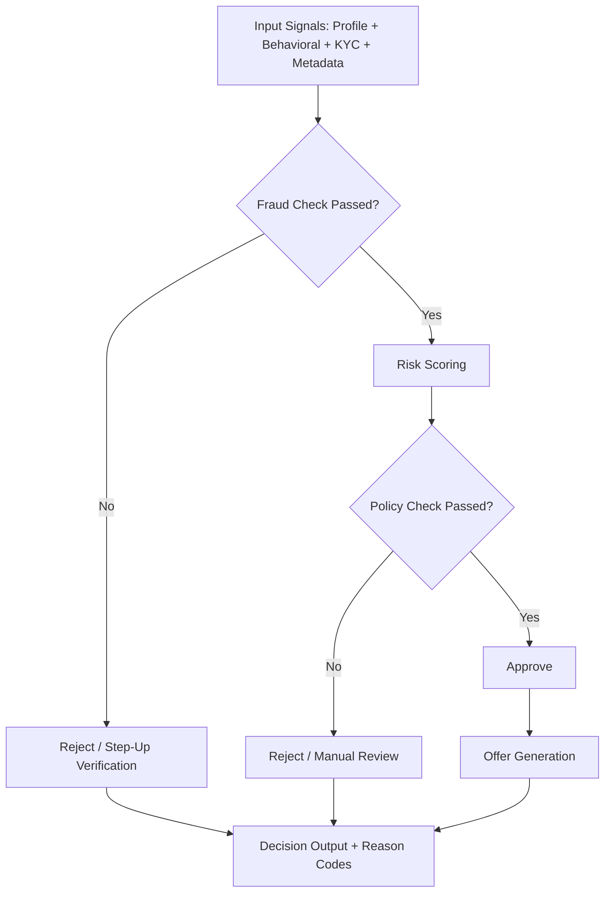
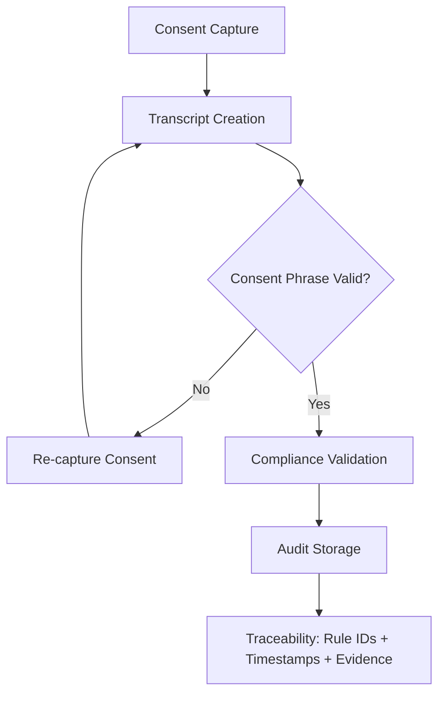

# TrustLens AI — Product Requirements Document (PRD)

## 1. Product Vision
TrustLens AI is a compliance-first, real-time video onboarding platform for digital lending that combines conversational intelligence, behavioral trust analytics, fraud detection, and deterministic policy enforcement to produce fast, explainable, and audit-ready onboarding decisions.

---

## 2. Problem Statement
Current digital loan onboarding is slow, easy to manipulate, and expensive to review. Static forms capture declared data but miss behavioral credibility, while manual KYC review adds latency and operational cost. Lenders need a system that can evaluate identity, intent, and risk in a single guided interaction.

---

## 3. Goals & Objectives
- Reduce onboarding decision turnaround from hours to minutes.
- Detect fraud and misrepresentation during the session, not after disbursal.
- Improve applicant completion and conversion through conversational UX.
- Enforce KYC, consent, and audit traceability for regulatory readiness.
- Generate explainable outcomes with reason codes and trust timelines.

---

## 4. Target Users
- **Primary:** NBFC lending, digital underwriting, and risk teams.
- **Secondary:** Compliance, KYC operations, fraud operations, internal audit.
- **End User:** Loan applicants across mobile and web channels.

---

## 5. Core Capability Stack
### 5.1 Cognitive Interview Engine
- Adaptive interview flow with dynamic follow-up questions.
- Clarification loops for low-confidence or ambiguous responses.
- Structured extraction of income, employment, intent, and obligations.

### 5.2 Behavioral Trust Engine
- Converts conversational and delivery signals into a normalized trust profile.
- Emits Trust Score (0–100), confidence band, and anomaly flags.
- Generates explainable factor-wise breakdown for reviewer visibility.

### 5.3 Compliance & KYC Layer
- Consent capture with timestamped transcript anchors.
- Face presence, liveness, and age-likelihood signals.
- Immutable audit record for replay and regulator traceability.

### 5.4 Risk + Policy Engine
- AI-assisted fraud and risk intelligence.
- Deterministic policy rules as final decision gate.
- Offer generation only for policy-compliant and eligible applicants.

### 5.5 Multi-Agent Orchestration
- Interview Agent
- Understanding Agent
- Behavioral Trust Agent
- Fraud Detection Agent
- Risk Scoring Agent
- Offer Agent

---

## 6. Behavioral Trust Scoring Framework
### 6.1 Trust Score Formula
**Trust Score (0–100)** =
- **0.30 × Response Consistency**
- **+ 0.20 × Voice Confidence**
- **+ 0.20 × Behavioral Stability**
- **+ 0.20 × (100 − Fraud Signals)**
- **+ 0.10 × Profile Completeness**

### 6.2 Factor Definitions
- **Response Consistency (0–100):** Measures alignment of current answers with earlier statements (income, employer, tenure, purpose).
- **Voice Confidence (0–100):** Measures vocal certainty from speech rate stability, filler-word density, and abrupt tone shifts.
- **Behavioral Stability (0–100):** Measures temporal steadiness of response patterns across the interview (sudden stress spikes reduce score).
- **Fraud Signals (0–100, inverse contribution):** Aggregates anomalies from device/IP mismatch, spoof suspicion, identity mismatch, and semantic contradictions.
- **Profile Completeness (0–100):** Measures required-field coverage and evidence sufficiency for underwriting.

### 6.3 Behavioral Intelligence Logic
- **Hesitation Detection:** Calculated from pause duration before answers, repeated restarts, and elevated filler tokens (for example: “uh”, “um”), normalized by question complexity.
- **Contradiction Detection:** The understanding layer converts responses into structured claims (entity, value, timestamp) and runs pairwise consistency checks against prior claims and submitted profile data.
- **Confidence Inference:** Derived from combined acoustic confidence (pace, pitch stability, articulation), response directness, and semantic certainty markers; low confidence is flagged when multiple weak signals co-occur.

---

## 7. Human vs AI Decision Boundary
- **AI role:** AI agents assist with understanding, behavioral interpretation, fraud indicators, and risk signals.
- **Final authority:** Deterministic policy rules execute hard compliance and eligibility checks.
- **Control principle:** If AI confidence is low or signals conflict, system routes to manual review rather than auto-approval.
- **Regulatory assurance:** Every final outcome is tied to policy version, rule IDs, reason codes, and traceable evidence.

---

## 8. Edge Case Handling & Fail-Safes
- **Poor network/audio quality:** Trigger quality gate, request repeat answer, switch to fallback question mode, and mark confidence downgrade.
- **No face detected:** Pause decision pipeline, prompt camera correction, retry bounded times, then route to assisted/manual verification.
- **Inconsistent answers:** Launch adaptive clarifying questions; unresolved contradiction increases fraud/risk and can force manual review.
- **High fraud score:** Enforce automatic step-up checks or hard reject based on configured threshold and policy rules.
- **Low-confidence cases:** Limit autonomous decisioning; require additional evidence or human adjudication before final disposition.

---

## 9. End-to-End Operational Flow
1. Applicant opens secure onboarding session link.
2. Consent and permissions are captured before processing.
3. Live AI interview collects audio, video, and response data.
4. AI stack extracts transcript, behavioral, and vision signals in real time.
5. Fraud and risk engines generate scored intelligence.
6. Deterministic policy applies final approve/reject/manual-review decision.
7. Offer engine runs for eligible users only.
8. Audit layer stores complete decision trace and artifacts.

---

## 10. Functional Requirements
- **FR-01:** Tokenized secure session initiation and expiry control.
- **FR-02:** Real-time media ingestion with latency-safe buffering.
- **FR-03:** Streaming STT with timestamped transcript persistence.
- **FR-04:** Explicit verbal consent capture and validation.
- **FR-05:** Face/liveness/age signal extraction pipeline.
- **FR-06:** Structured profile extraction from conversation.
- **FR-07:** Behavioral trust scoring with explainable factor breakdown.
- **FR-08:** Fraud scoring using multimodal anomaly indicators.
- **FR-09:** Risk scoring and deterministic policy execution.
- **FR-10:** Offer generation for eligible users.
- **FR-11:** Human-readable decision explanation and trust timeline.
- **FR-12:** Immutable audit package storage and retrieval.

---

## 11. Non-Functional Requirements
- **Latency:** Insight updates in near real time; final decision target under 120 seconds.
- **Availability:** 99.9% service uptime target.
- **Scalability:** Horizontal concurrency for peak campaign spikes.
- **Security:** Encryption in transit/at rest, RBAC, PII minimization and masking.
- **Compliance:** Consent traceability, replayable decision evidence, immutable logs.
- **Observability:** Event tracing, model/version lineage, policy version capture.

---

## 12. Success Metrics
- Onboarding completion rate uplift
- Decision turnaround time reduction
- Fraud catch rate and false-positive control
- Manual review rate reduction
- Offer acceptance rate
- Compliance evidence completeness
- Audit retrieval SLA adherence

---

## 13. System Flowcharts (Mermaid)

### 13.1 End-to-End System Flow

### 13.2 AI Processing Pipeline

### 13.3 Decision Engine Flow

### 13.4 Compliance Flow

---

## 14. API Surface (Indicative)
| Endpoint | Purpose |
|---|---|
| `POST /api/v1/sessions/init` | Start secure onboarding session |
| `POST /api/v1/sessions/{id}/start` | Begin controlled interview session |
| `POST /api/v1/stream/audio` | Ingest audio chunks for STT/behavior |
| `POST /api/v1/stream/video` | Ingest video frames for vision/fraud |
| `POST /api/v1/consent/capture` | Record and validate consent |
| `POST /api/v1/profile/extract` | Build structured applicant profile |
| `POST /api/v1/fraud/evaluate` | Compute fraud score and flags |
| `POST /api/v1/risk/evaluate` | Compute risk score and eligibility |
| `POST /api/v1/decision/generate` | Execute deterministic final decision |
| `POST /api/v1/offers/generate` | Generate offer options for approved users |
| `POST /api/v1/audit/store` | Persist immutable audit package |
| `GET /api/v1/sessions/{id}/timeline` | Fetch trust and compliance timeline |

---

## 15. Hackathon Differentiation
- Real-time behavioral trust scoring fused with fraud and risk intelligence.
- Strong AI depth with multimodal processing (speech + NLP + vision).
- Explicit AI-to-policy boundary aligned with fintech regulation.
- Explainable trust timeline for judges, risk teams, and auditors.
- Deployable architecture with clear path from mock integrations to production services.
